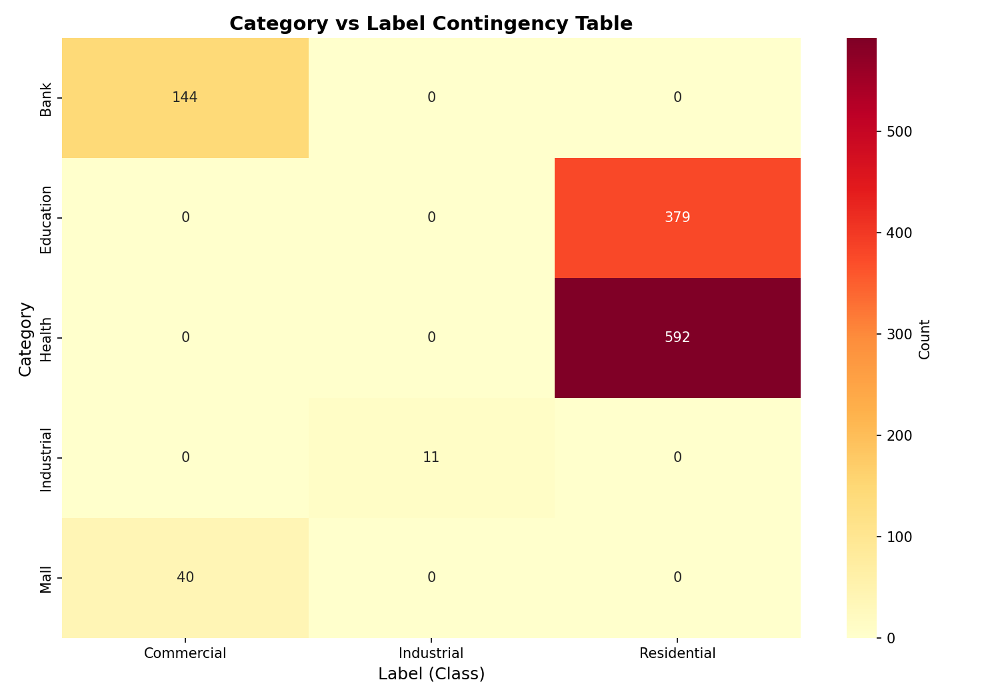
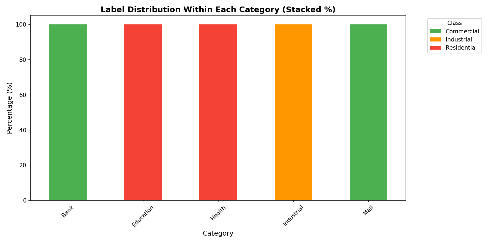
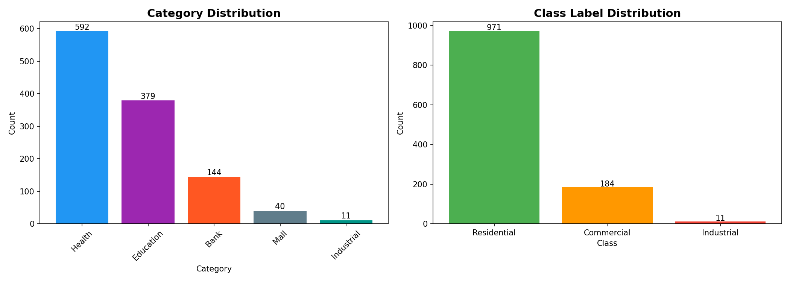

# Label Leakage Audit Report

**Date:** 2026-06-21  
**Dataset:** `data/raw/project.csv` (1166 samples)  
**Classes:** 0 = Residential, 1 = Commercial, 2 = Industrial  
**Model:** UrbanMLP (multi-modal: POI text + satellite image + road network)

---

## 1. Executive Summary

**Label leakage is confirmed with 100% certainty.**

The `category` column perfectly determines the `label` column. Every category maps **exclusively** to a single class. The model does not need satellite images or road network features — it can achieve perfect accuracy using only the POI text description, which contains the place type that directly implies the label.

**Severity: CRITICAL.** The current near-perfect validation accuracy (100%) is meaningless because it reflects memorization of category-to-label rules, not learning of actual urban spatial characteristics.

---

## 2. Root Cause: How Leakage Occurs

### 2.1. Direct Leakage (Label Construction)

In `scripts/relabel_dataset.py` (line 45), the `label` column is derived directly from `category`:

```python
category_mapping = {
    "Education": 0, "Health": 0,   # → Residential
    "Mall": 1, "Bank": 1,          # → Commercial
    "Industrial": 2                # → Industrial
}
df["label"] = df["category"].map(category_mapping)
```

### 2.2. Indirect Leakage (Feature Pathway)

The `category` column is **not** used as a direct model feature. However, the `text_des` (text description) column **is** used as a feature (via SentenceTransformer embedding). Each `text_des` contains the `place_type`, which perfectly correlates with `category`:

| place_type      | category    | label |
|-----------------|-------------|-------|
| School, University | Education  | 0 (Residential) |
| Clinic, Hospital | Health      | 0 (Residential) |
| Bank, Atm       | Bank        | 1 (Commercial)  |
| Mall            | Mall        | 1 (Commercial)  |
| Industrial      | Industrial  | 2 (Industrial)  |

The SentenceTransformer encoder embeds texts like:
- `"تقع الصديق في القاهرة، مصر. نوع المنطقة: مدرسة. البيانات من OpenStreetMap."` → label 0
- `"تقع البنك الأهلي في القاهرة، مصر. نوع المنطقة: بنك. البيانات من OpenStreetMap."` → label 1

The MLP learns to map "مدرسة" (school) → 0, "بنك" (bank) → 1, "مصنع" (factory) → 2 from the text embeddings, ignoring the actual satellite imagery and road topology.

---

## 3. Contingency Table: Category × Label

| Category   | Residential (0) | Commercial (1) | Industrial (2) | Total |
|------------|:---------------:|:--------------:|:--------------:|:-----:|
| Bank       | 0               | 144            | 0              | 144   |
| Education  | 379             | 0              | 0              | 379   |
| Health     | 592             | 0              | 0              | 592   |
| Industrial | 0               | 0              | 11             | 11    |
| Mall       | 0               | 40             | 0              | 40    |
| **Total**  | **971**         | **184**        | **11**         | 1166  |

**Every non-zero cell is 100% pure** — no category has samples in more than one label.

---

## 4. Percentage Distributions

### By Category (Row %)

| Category   | Residential | Commercial | Industrial |
|------------|:-----------:|:----------:|:----------:|
| Bank       | 0.00%       | **100.00%** | 0.00%     |
| Education  | **100.00%** | 0.00%      | 0.00%     |
| Health     | **100.00%** | 0.00%      | 0.00%     |
| Industrial | 0.00%       | 0.00%      | **100.00%** |
| Mall       | 0.00%       | **100.00%** | 0.00%     |

### By Label (Column %)

| Category   | Residential | Commercial | Industrial |
|------------|:-----------:|:----------:|:----------:|
| Bank       | 0.00%       | 78.26%     | 0.00%      |
| Education  | 39.03%      | 0.00%      | 0.00%      |
| Health     | 60.97%      | 0.00%      | 0.00%      |
| Industrial | 0.00%       | 0.00%      | 100.00%    |
| Mall       | 0.00%       | 21.74%     | 0.00%      |

---

## 5. Statistical Tests

| Metric                 | Value        | Interpretation                              |
|------------------------|-------------:|---------------------------------------------|
| **Mutual Information** | 0.4878 nats  | Very strong dependency                      |
| **Normalized MI**      | 0.4559       | ≈46% of uncertainty explained by category   |
| **Chi-Square**         | 2332.00      | Perfect dependence (df=8)                   |
| **p-value**            | 0.00         | Statistically significant beyond any doubt  |
| **Cramer's V**         | 1.0000       | **Perfect association** (maximum possible)  |
| **Exclusive mappings** | 5/5          | Every category maps to exactly one label    |

**Cramer's V = 1.0** means the category and label are deterministically linked. There is zero ambiguity.

---

## 6. Training History Confirms Leakage

From `evals/training_history.json`:

| Epoch | Validation Accuracy |
|:-----:|:-------------------:|
| 1     | 89.05%              |
| 2     | 98.54%              |
| 3     | 98.54%              |
| 4     | 98.54%              |
| 5     | **100.00%**         |
| ...   | 100.00%             |

The model reaches near-perfect accuracy by epoch 2 and perfect accuracy by epoch 5. This is **far too fast** for learning genuine multi-modal urban features — it indicates the model is simply learning the deterministic place_type → label mapping embedded in the text descriptions.

---

## 7. Visualizations

### 7.1. Heatmap of Category × Label


The heatmap shows a perfectly diagonal (plus dual Commercial columns) structure. Zero off-diagonal counts confirm no category shares multiple labels.

### 7.2. Stacked Bar Chart (Label Distribution per Category)


Every bar is a single solid color — each category belongs 100% to one class.

### 7.3. Category & Label Distributions


Shows the imbalance: Residential dominates (971), Commercial has some (184), Industrial is severely underrepresented (11).

---

## 8. Conclusion

### The model is NOT learning urban characteristics.

The model is **memorizing category-to-label mappings** through the text description feature. The satellite imagery (ResNet18) and road network (OSMnx) features are effectively ignored because the model can achieve 100% accuracy using only the POI text embedding.

### What needs to happen:

1. **Remove the leakage source**: The `label` column must not be deterministically derived from the `category` column. Labels should reflect actual land-use class derived from ground truth or spatial analysis, not from the POI category alone.

2. **Fix the relabeling script**: `scripts/relabel_dataset.py` should not use `df["label"] = df["category"].map(category_mapping)`. Labels must come from an independent source.

3. **Re-evaluate model performance**: After fixing leakage, retrain and measure actual accuracy. Current 100% accuracy is invalid.

4. **Class balance**: Industrial class has only 11 samples (0.9%). This is insufficient for meaningful learning regardless of leakage.

5. **Text feature sanitization**: Consider removing or masking place_type information from `text_des` if the goal is to evaluate only spatial/visual features.

6. **Abalation testing**: After fixing, run modality ablation to confirm each modality contributes meaningful signal.

---

## 9. Recommendations for Remediation

| Priority | Action | Details |
|:--------:|--------|---------|
| **P0** | Decouple labels from categories | Labels should come from ground truth spatial data, not POI categories |
| **P1** | Re-run training with fixed labels | Evaluate actual multi-modal performance |
| **P2** | Balance Industrial class | Collect real Industrial POIs or use augmentation |
| **P3** | Add modality ablation tests | Verify each modality contributes independently |
| **P4** | Sanitize text descriptions | Mask place_type to prevent text-based shortcut learning |

---

*Report generated by automated leakage audit script. All statistics computed from `data/raw/project.csv`.*
